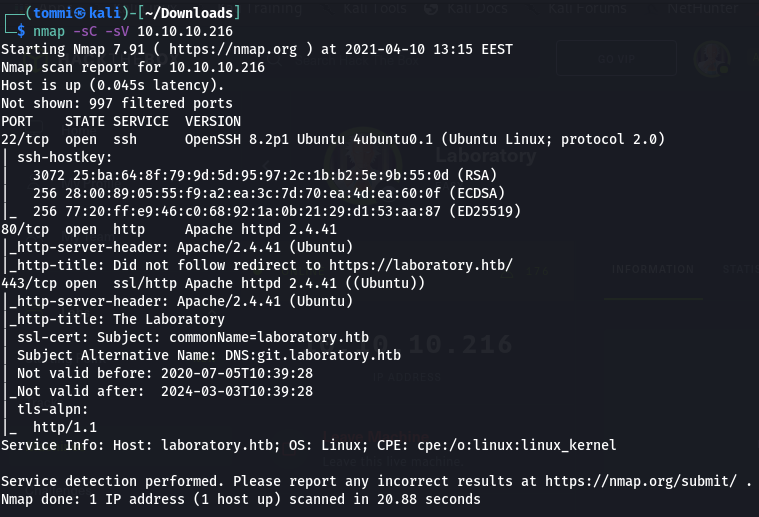
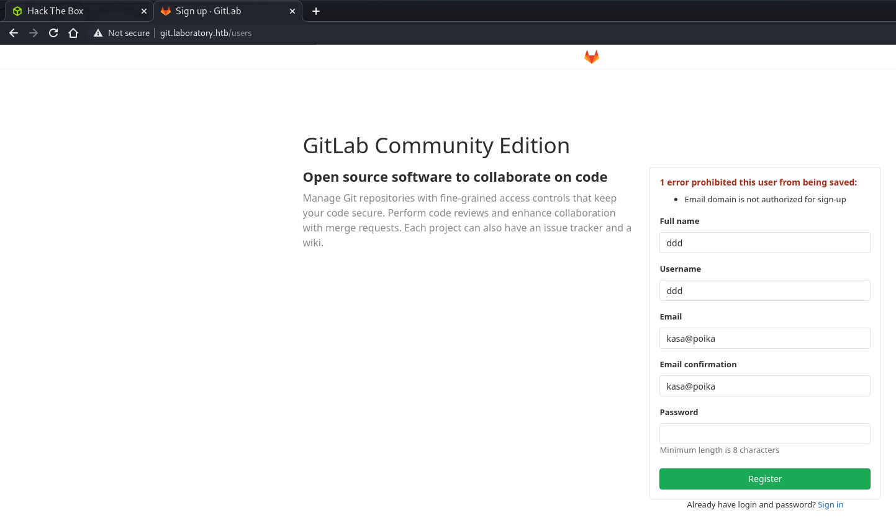
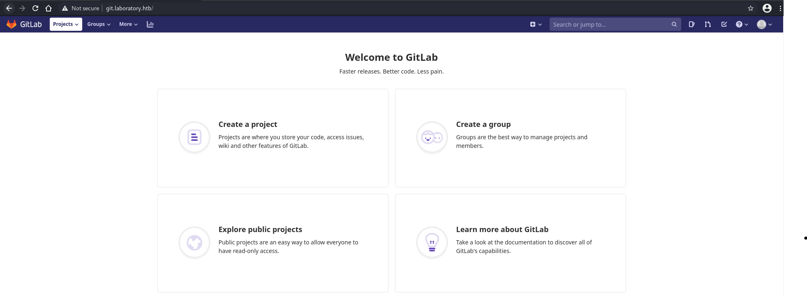
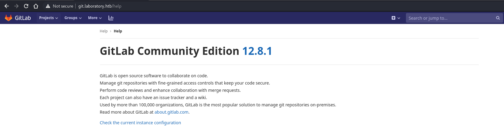
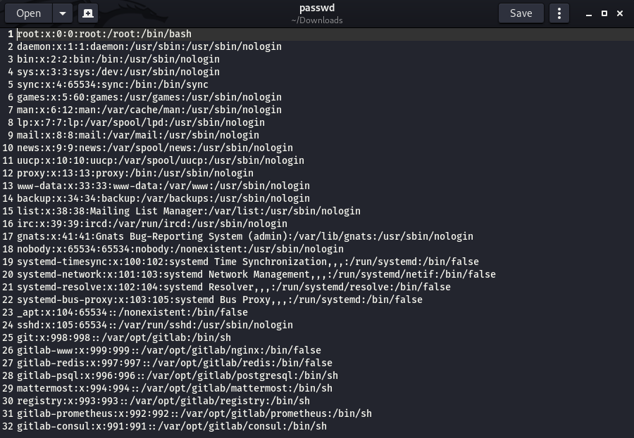
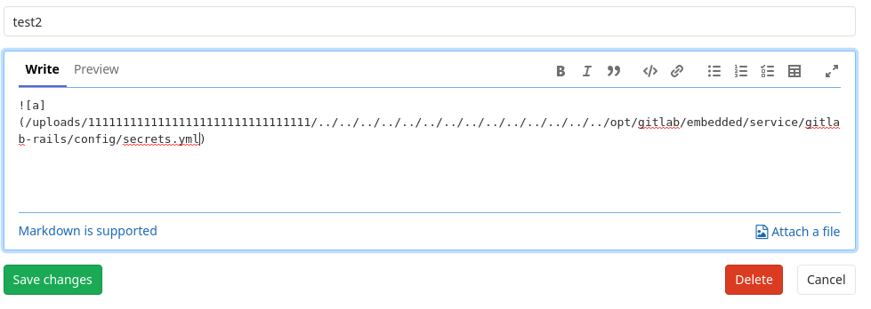
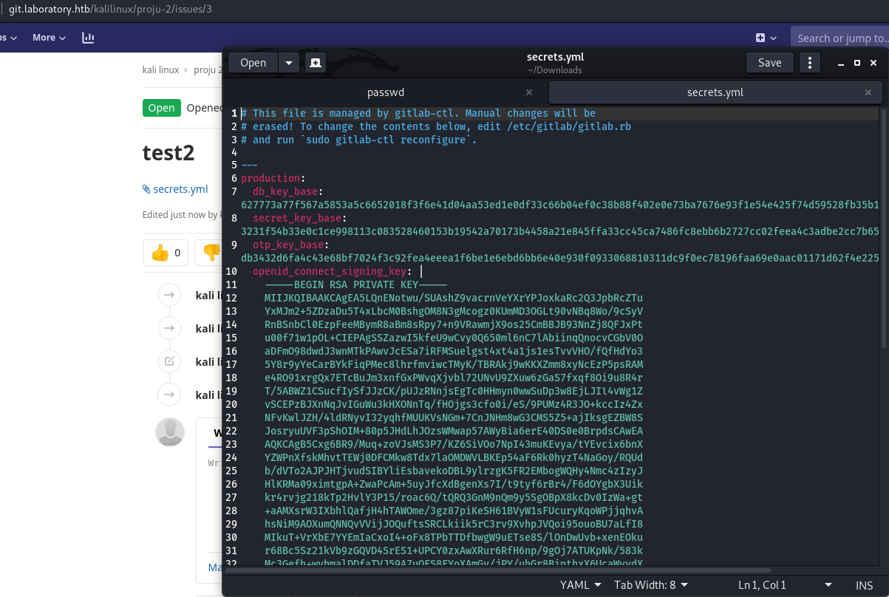

# Write up for Hack The Box machine Laboratory

As of 17th of April 2021, the machine in question called "Laboratory" from HTB has retired, so the write up does not need to be password protected. 

## The decision behind picking this machine

We are doing this project for course "Cybersecurity management" in our university of Haaga-Helia UAS. For this course we wanted to have a project where we could use our prior knowledge of pentesting, and so we decided to analyze and breach into a target that is both legal and ethical. We used Hack The Box, since it was familiar to us. 

Laboratory has a main flaw in it that is old version of Gitlab that allows remote code execution. Gitlab is a git program that is used by many corporations and so it is closely related to any corporations cybersecurity. In this case the target is an fictional penetration testing / hacking company ran by a alias called Dexter. They claim that they cannot be hacked and that everything they produce is 100% safe. Well we took it personally and decided to test, if their claim was true.

### First reconnaissance with nmap and gobuster

First we decided to start looking into our target and because i knew how most of the HTB machines work, i prematurely added "laboratory.htb" into our /etc/hosts file. 

After this i decided to run a basic nmap on our target to figure out what ports were open and what could we do next. By this point we of course didn't know anything about the target since we were just starting so this would help us a lot.

From this scan we can see that there is another alternative name called "git.laboratory.htb", so we also added this to our /etc/hosts file. We could see that the system is Linux, but we expected this anyways since HTB site tells the OS of the machine. Otherwise this scan was a dud since it really didn't tell us anything important. There are ports 22(SSH), 80(apache/laboratory.htb) and 443(apache/git.laboratory.htb). 

Since we now know that there is a hidden site "git.laboratory.htb" we can assume that this would be a good time to see what secrets the site hides. What we found from there is a Gitlab site for the company that Dexter runs. To proceed forward we need to create and account to the Gitlab, so we proceed and try to create account with fake information and also fake email with made up domain. After we try to register the form denies our registeration since our email domain is not accepted.

Since this is pretty simple issue we just change the domain into "laboratory.htb" and we succeed in getting into the Gitlab service.

Now that we are in we decided to look around and we didn't really find anything interesting that could help us move forward instantly, so we decided to set gobuster look out for most used subsites from the git. After looking for a while gobuster found /help site so we decided to check it out and from there we saw the version that Gitlab was running as of now.

As it turns out the Gitlab is running version 12.8.1 and we can now look out if there are any exploits to be used on this version of gitlab. We set out to look for a exploit and instantly we found and exploit for remote code execution. After a while we also found another type of exploit that allows arbitrary file read using issues in Gitlab projects. The exploit was from [HackerOne](https://hackerone.com/reports/827052). Using the example from HackerOne we wanted to try if we could first retrieve a file from the target system. We wanted to get file from /etc called "passwd". This file includes users from the system. We followed the example and created 2 projects and using the arbitrary file read exploit we moved issue from project 1 to project 2 and we gained the file we wanted.

Then of course we wanted to take a peep of what we gained.

From the file, one thing that we noticed was that there is a user called "git", and so we assumed that this indeed is the account that is used to maintain their Gitlab. But with mere arbitrary file read we cannot do more since actual file with password hashes is protected, so we decided to keep reading HackerOne's report and we found out a way to get the secret key for the Gitlab from targets /opt/gitlab/embedded/service/gitlab-rails/config/ folder. Using the same idea we now snatched the secrets.yml file from the target.

Now that we have the targets secret_key_base we need to find out a way to use it. 
