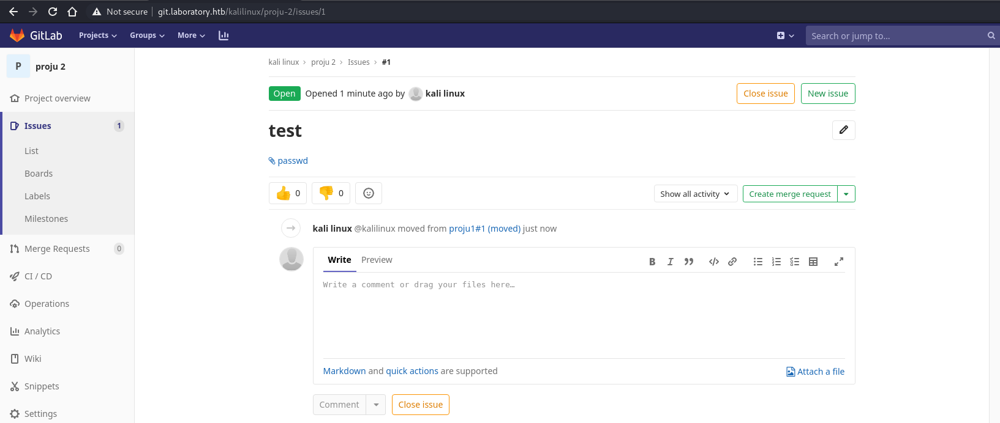

# Write up for Hack The Box machine Laboratory

As of 17th of April 2021, the machine in question called "Laboratory" from HTB has retired, so the write up does not need to be password protected. 

## The decision behind picking this machine

We are doing this project for course "Cybersecurity management" in our university of Haaga-Helia UAS. For this course we wanted to have a project where we could use our prior knowledge of pentesting, and so we decided to analyze and breach into a target that is both legal and ethical. We used Hack The Box, since it was familiar to us. 

Laboratory has a main flaw in it that is old version of Gitlab that allows remote code execution. Gitlab is a git program that is used by many corporations and so it is closely related to any corporations cybersecurity. In this case the target is an fictional penetration testing / hacking company ran by an alias called Dexter. They claim that they cannot be hacked and that everything they produce is 100% safe. Well we took it personally and decided to test, if their claim was true.

### First reconnaissance with nmap and gobuster

First we decided to start looking into our target and because we knew how most of the HTB machines work, we prematurely added "laboratory.htb" into our /etc/hosts file. 

After this we decided to run a basic nmap on our target to figure out what ports were open and what we could do next. By this point we of course didn't know anything about the target since we were just starting, so the scan would help us a lot.

From this scan we can see that there is another alternative name called "git.laboratory.htb", so we also added this to our /etc/hosts file. We could see that the system is Linux, but we expected this anyways since HTB site tells the OS of the machine. Otherwise this scan was a dud since it really didn't tell us anything important. There are open ports 22(SSH), 80(apache/laboratory.htb) and 443(apache/git.laboratory.htb). 

Since we now know that there is a hidden site "git.laboratory.htb" we can assume that this would be a good time to see what secrets the site has hidden. What we found from there is a Gitlab site for the company that Dexter runs. To proceed forward we need to create and account to the Gitlab, so we proceed and try to create account with fake information and also fake email with made up domain. After we try to register the form denies our registeration since our email domain is not accepted.

Since this is pretty simple issue we just change the domain into "laboratory.htb" and we succeed in getting into the Gitlab service.

Now that we are in we decided to look around and we didn't really find anything interesting that could help us move forward instantly, so we decided to set gobuster look out for most used subsites from the git. After looking for a while gobuster found /help site so we decided to check it out and from there we saw the version that Gitlab was running as of now.

### Time to start attacking the target

As it turns out the Gitlab is running version 12.8.1 and we can now look out if there are any exploits to be used on this version of gitlab. We set out to look for a exploit and instantly we found and exploit for remote code execution. After a while we also found another type of exploit that allows arbitrary file read using issues in Gitlab projects. The exploit was from [HackerOne](https://hackerone.com/reports/827052). Using the example from HackerOne we wanted to try if we could first retrieve a file from the target system. We wanted to get file from /etc called "passwd". This file includes users from the system. We followed the example and created 2 projects and using the arbitrary file read exploit we moved issue from project 1 to project 2 and we gained the file we wanted.

Then of course we wanted to take a peep of what we gained.

From the file, one thing that we noticed was that there is a user called "git", and so we assumed that this indeed is the account that is used to maintain their Gitlab. But with mere arbitrary file read we cannot do more since actual file with password hashes is protected, so we decided to keep reading HackerOne's report and we found out a way to get the secret key for the Gitlab from target's /opt/gitlab/embedded/service/gitlab-rails/config/ folder. Using the same idea we now snatched the secrets.yml file from the target.

Now that we have the targets secret_key_base we need to find out a way to use it. This was indeed not hard as the same conversation that reported about the secrets file lets us know that we can replace our own local Gitlab instance's secret_key_base into the one we got from the target and by this we can try to use the remote code execution exploit. We started this by downloading the packet for installing the same version of Gitlab as the target has. After that we installed the Gitlab on our computer.

After we installed the Gitlab we configured it and reloaded it once so it created all the files that it needs to work. After this we just changed our local secret key for the one from the target. Now we ran the console and now is the time to create PoC for the RCE.

Now that we have the connection to our local Gitlab that has the secret key from the target we can use the RCE and try to get in to the target. First of all we wanna do a proof of concept so that we know everyhting works. Following still the same article from HackerOne that had the information about the secret key and how to use it, they tell us the method how we can execute code remotely. Basically we create a cookie that includes the command we want to be executed in the target. After we have created the cookie we send it to the target and with this it should be done. After we followed the PoC that was included in the report we went to see if our command was executed and so we used the same arbitary file read method as before and as you can see, our code to create a file into the targets /tmp was successful.

Now that the PoC works it's time to start thinking how we could get in to the system. Easiest way would be to create a file that would create a shell and so that file could be executed in the target machine. We tried few different setups here and eventually after creating a file called "reverse.sh" that has the code for the shell and after we modified the PoC command into trying to get the target to download the file and then to executue it, we just could not get it to work as we wanted.

After taking a breather it dawned to us that because the exploit is a remote code execution, there probably is a ready payload in metasploit and as it turns out there is one. After setting up the metasploit payload with correct settings as seen below, we ran it and got our reverse shell into something. 

Now that we are in we can confirm that git is indeed used to manage Gitlab. Now we need to figure out if this is the main system or some other type of environment. We use a method of checking if we are inside a container. We cat insides of /proc/1/cgroup and it seems that we indeed are inside a container. From here on we have no experience of getting out of the container and by a short look, it seems that it wont even be possible. We wanted to go back to Gitlab and to see if we could exploit the user of Dexter. We looked for a way to change password of user in Gitlab rails console and found out that it is very easy. We first started production console and then we checked if Dexter is an user and it seems that his user id is 1. Then we selected the user with id 1 and changed the password and confirmed it and saved it.

Now we tried to log into user (dexter@laboratory.htb) with new password and it was success!

Now we can start looking into his projects. After a while we found really interesting file, the id_rsa for his SSH login. This in itself is a huge risk for cybersecurity since the whole Gitlab environment is open to outside networks and that the id_rsa key of user is just behind 1 password. 

With this we just copied the key into a file called "id_rsa" and used it to log into dexter in the laboratory.htb. First we received error with the login since the file we created didn't have correct permissions, but after that was fixed we got in and found the user flag. 

Now that we have user in the main system we have to find either a way to escalate our privileges. After finding few different ways, one that striked us as possible here would be to escalate privileges using PATH variable. We followed instructions from [hackingarticles.in](https://www.hackingarticles.in/linux-privilege-escalation-using-path-variable/) and after we understood how this exploit would work we looked for file with 4000 permissions. We found out that there is such a file called "docker-security" in /usr/local/bin/.

 

With this we wanted to see what did the binary hold in and it has come chmod commands that are configured wrong. 

After this we simply followed the guide on privilege escalation using PATH variable and we just ran the commands following the method 2 escalation. With this we modified the "docker_security" into actually forcing us to root account. Since the file "docker_security" has SUID permissions it can do that and now we have root access and access to the root flag.

That's all for the machine, it was a wild ride and it took us easily over 15 hours because of the few rabbit holes and some methods we couldn't get working.

## Conclusion regarding the project

After we solved the machine we were even more sure that this machine was a perfect case for our project. The flaws that were used here are all common flaws that any business could have. The fact that there is an old version of program like Gitlab is a huge risk for a company. There will be more analyzation regarding the exploit in another report and there will probably be another writeup of more challenging machine if we have time for that. 
