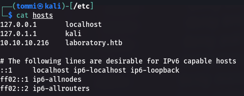

# Write up for Hack The Box machine Laboratory

As of 17th of April 2021, the machine in question called "Laboratory" from HTB has retired, so the write up does not need to be password protected. 

## The decision behind picking this machine

We are doing this project for course "Cybersecurity management" in our university of Haaga-Helia UAS. For this course we wanted to have a project where we could use our prior knowledge of pentesting, and so we decided to analyze and breach into a target that is both legal and ethical. We used Hack The Box, since it was familiar to us. 

Laboratory has a main flaw in it that is old version of Gitlab that allows remote code execution. Gitlab is a git program that is used by many corporations and so it is closely related to any corporations cybersecurity. In this case the target is an fictional penetration testing / hacking company ran by a alias called Dexter. They claim that they cannot be hacked and that everything they produce is 100% safe. Well we took it personally and decided to test, if their claim was true.

### First reconnaissance with nmap and gobuster

First we decided to start looking into our target and because i knew how most of the HTB machines work, i prematurely added "laboratory.htb" into our /etc/hosts file. 

After this i decided to run a basic nmap on our target to figure out what ports were open and what could we do next. By this point we of course didn't know anything about the target since we were just starting so this would help us a lot.

From this scan we can see that there is another alternative name called "git.laboratory.htb", so we also added this to our /etc/hosts file. We could see that the system is Linux, but we expected this anyways since HTB site tells the OS of the machine. Otherwise this scan was a dud since it really didn't tell us anything important. There are ports 22(SSH), 80(apache/laboratory.htb) and 443(apache/git.laboratory.htb). 
